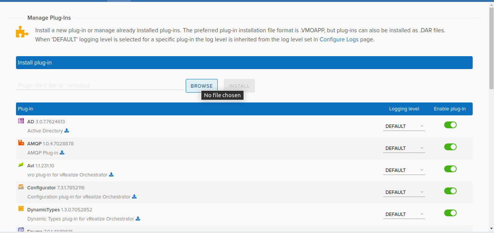

## avi-vrealize-orchestrator-plugin
Avi vRealize Orchestrator Plugin

- This project contains AVI vRO Plugin.
- To install plugin on the VRO, follow the steps

##Clone the repo to your local
> https://github.com/avinetworks/avi-vrealize-orchestrator-plugin.git


## Installing plugin to vRealize Orchestrator

    * Open controller in browser(e.g. https://10.79.170.170:8281/vco/)
   
    
    * Click on Orchestrator Control Center.
   
    
    * Cick on Manage Plug-ins & Browse Plugin
   
    
    * Select the dar file from the location where we clone the repo.
   
    
    * Click on install 
   
    * After installation, Open Orchestrator.
    
    * Refresh the VRO you can see the workflow under Workflows tab inside Library > vro folder and actions under Actions tab inside com.vmware.actions folder
   
   

   * Afrer refresh, Check workflows. There will be new imported workflows.
```  

