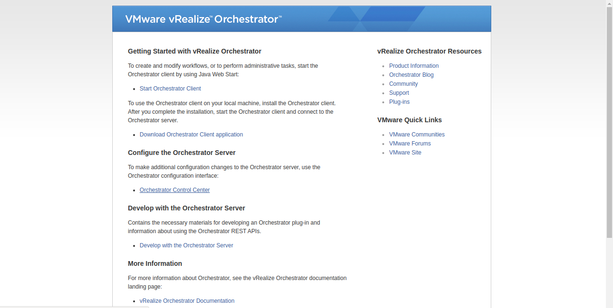
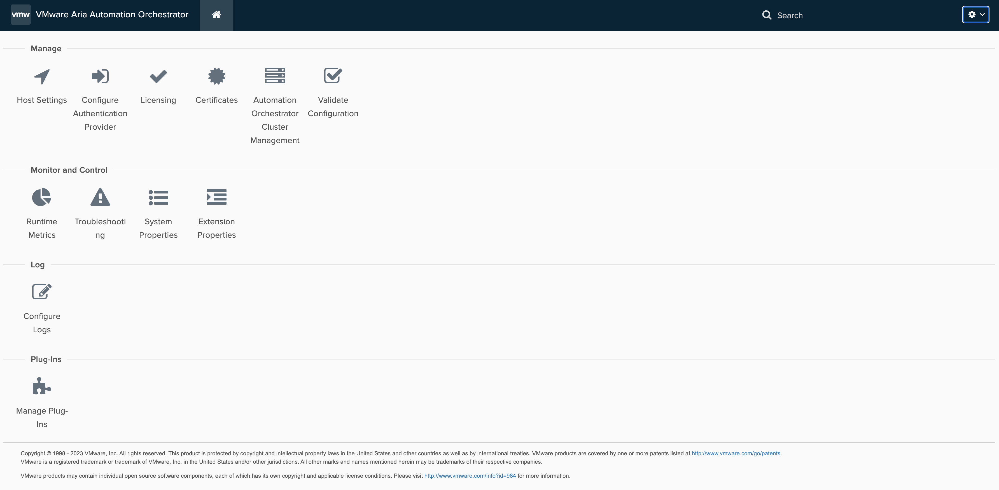
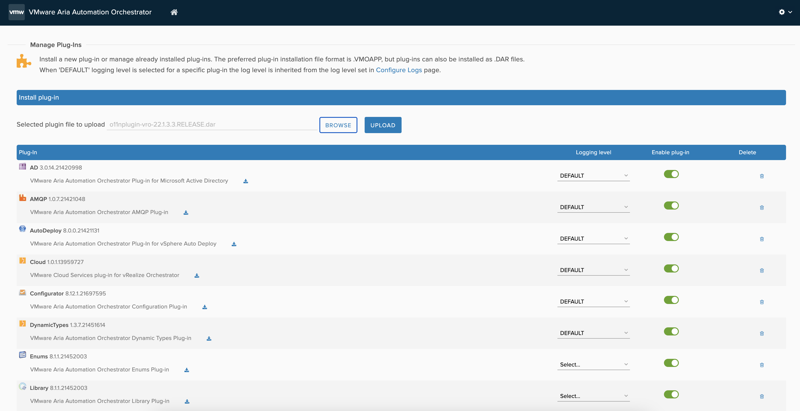
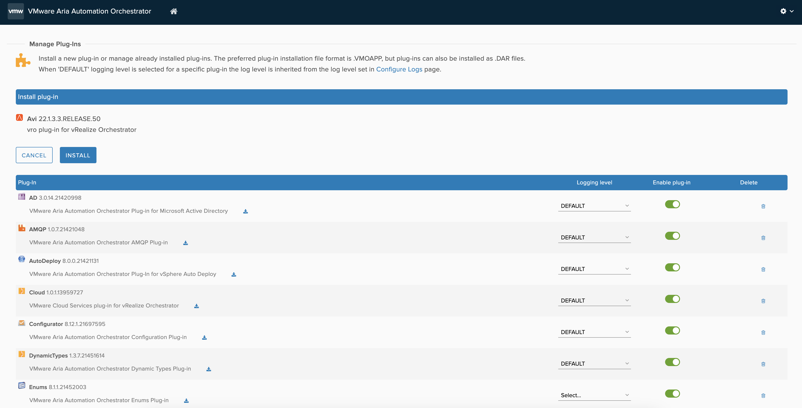
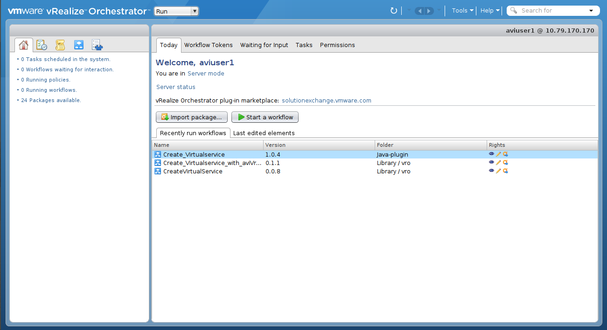
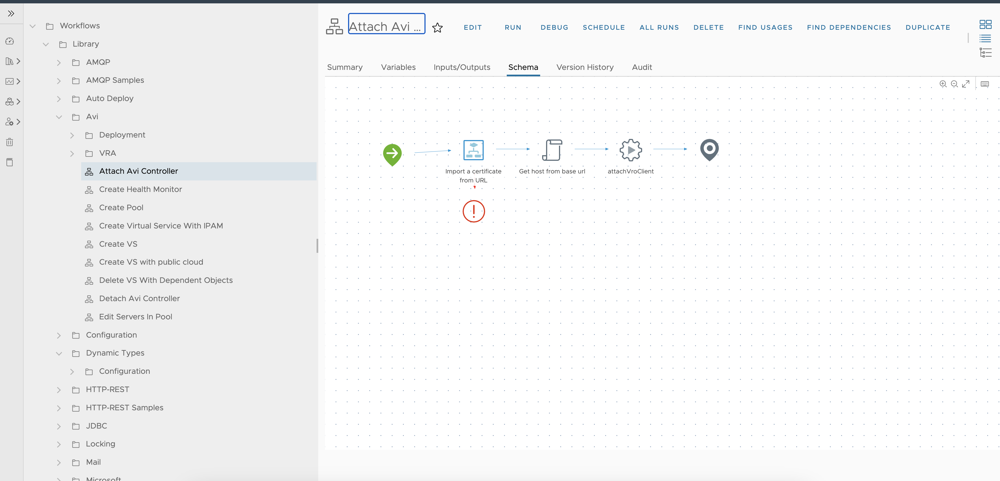
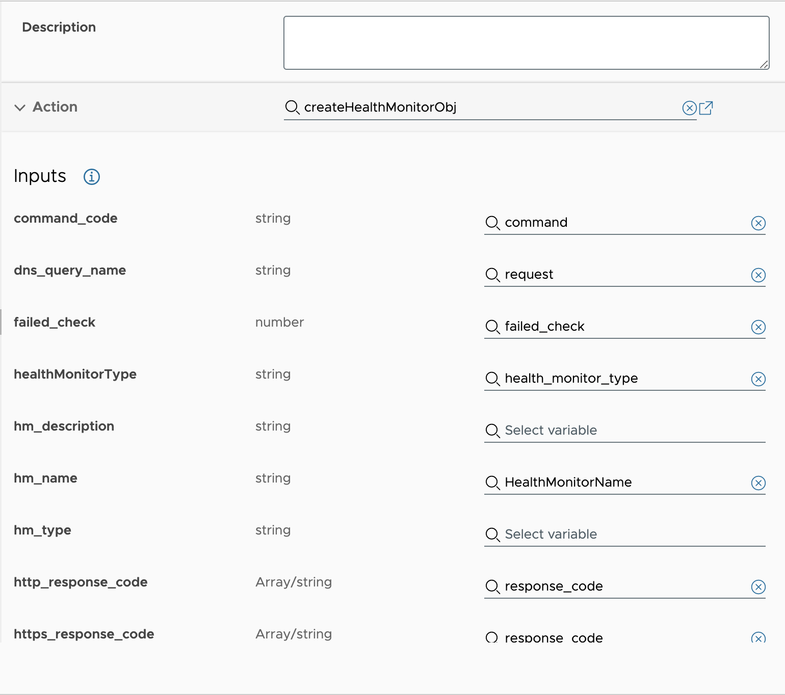

## aria-automation-orchestrator-plugin-for-alb
Avi VMware Aria Automation Orchestrator​ Plugin

- This project contains AVI vRO Plugin.
- To install plugin on the VRO, follow the steps
- To create custom workflows and actions, follow the steps given below.

* Note: All vRO workflows and actions in the AVI plugin are examples of how to create an actions and workflows. Based on these examples, users should create their own actions and workflows.

## Clone the repo to your local
> https://github.com/avinetworks/avi-vrealize-orchestrator-plugin.git


## Installing plugin to VMware Aria Automation Orchestrator​

    * Download the dar file from https://github.com/vmware/vrealize-orchestrator-plugin-for-alb/releases/download/22.1.3.post3/o11nplugin-vro-22.1.3.3.RELEASE.dar
    * Enter the Ip of Vro instance in browser and click on Orchestrator Control Center.
   
    
    * Cick on Manage Plug-ins & Browse Plugin
   
    
    * Upload the downloaded dar file from the git repo.
   
    
    * Click on install.(after installation VRO will restart this may take some time)
   
   
    * After installation, Open Orchestrator.
    
    * Refresh the VRO.
   
   

    * Afrer refresh, you can see the workflow under Workflows tab inside Library > Avi folder and actions under Actions tab inside com.vmware.avi folder.
   


## Below are the steps to create custom workflows and actions using AVI vRO plugin.

Some actions we have already provided to create objects like, Virtual Service, VsVip, Pool and HealthMonitor. 
Actions are JavaScript functions. Actions can take multiple input parameters and have a single return value. 
To create any specific objects on the AVI controller using vRO action user should use Java models for the same.

### Example to create an action in vRO appliance.

* Every action should have **workflowRuntime** input parameter which will have the session object of the AVI controller. 
Below example will create an HealthMonitor object on the AVI controller using vRO actions and AVI vRO plugin.
User can map all parameters to the object using getter and setter methods.
Refer AVI controller API documentation which can find https://<controller_ip>/swagger/#/ to check mandatory/default fields for AVI objects.
- For the below example input parameters are,
    * Tenant, HealthMonitorName, workflowRuntime

```javascript
// Create HealthMonitor object with input parameters
healthMonitorObj = new AviHealthMonitor();
healthMonitorObj.setTenantRef("/api/tenant?name="+Tenant);
healthMonitorObj.setName(HealthMonitorName);
healthMonitorObj.setType("HEALTH_MONITOR_PING");
healthMonitorObj.setSendInterval(20);
// Get created session client for AVI contoller
client = workflowRuntime.getAviVroClient();
client.addObject(healthMonitorObj, workflowRuntime.getWorkflowId(), Tenant);    
response = client.executeWorkflow(workflowRuntime.getWorkflowId());
return response;
```

### Example to create vRO workflows.

* Every workflow should have **initVroWorkflow** action to get AVI controller session object using controller IP/fqdn.
* **initVroWorkflow** action will return **workflowRuntime** object which can be used in the workflow to create all added
AVI objects on the controller in the last step of workflow.
* **finishVroWorkflow** action will create all added objects in one go. This action internally used the **workflowRuntime**
object, this object will have all objects data.
* Please, refer the workflows that are present in the AVI vRO plugin to create custom workflows.
* We have provided **Reconfigure Virtual Service** workflow to update virtualservice data. We have added some basic configuration in this workflow to update virtual service fields. User can add any additional parameters in this workflow and map that parameter to the action.

Reconfigure Virtual Service Workflow Inputs:
    All fields are autopopulated based on virtual service object in this workflow. Below are the basic input parameters for the workflow.

    | Variable              |   Description                     |
    | --------------------  |  ---------------------------------|
    |virtual_service_object |   Virtual Service Object          |
    | controller            |   Controller IP                   |
    | server_cloud          |   Server Cloud Name               | 
    | name                  |   Virtual Service name            |
    | application_profile   |   Application Profile Name        |
    | service_port          |   Virtual Service port            |
    | vip                   |   VIP IP                          |
    | pool_servers          |   Pool servers list               |
    | instance_port         |   Instance Port                   |
    | health_monitor_name   |   Health Monitor Name             |
    | time_out              |   Health Monitor Timeout          |
    | send_interval         |   Health Monitor Send Interval    | 
    | successful_check      |   Health Monitor Successful Check |
    | failed_check          |   Health Monitor Failed Check     |


Example mapping of inputs for workflow and action will look like below,


```

